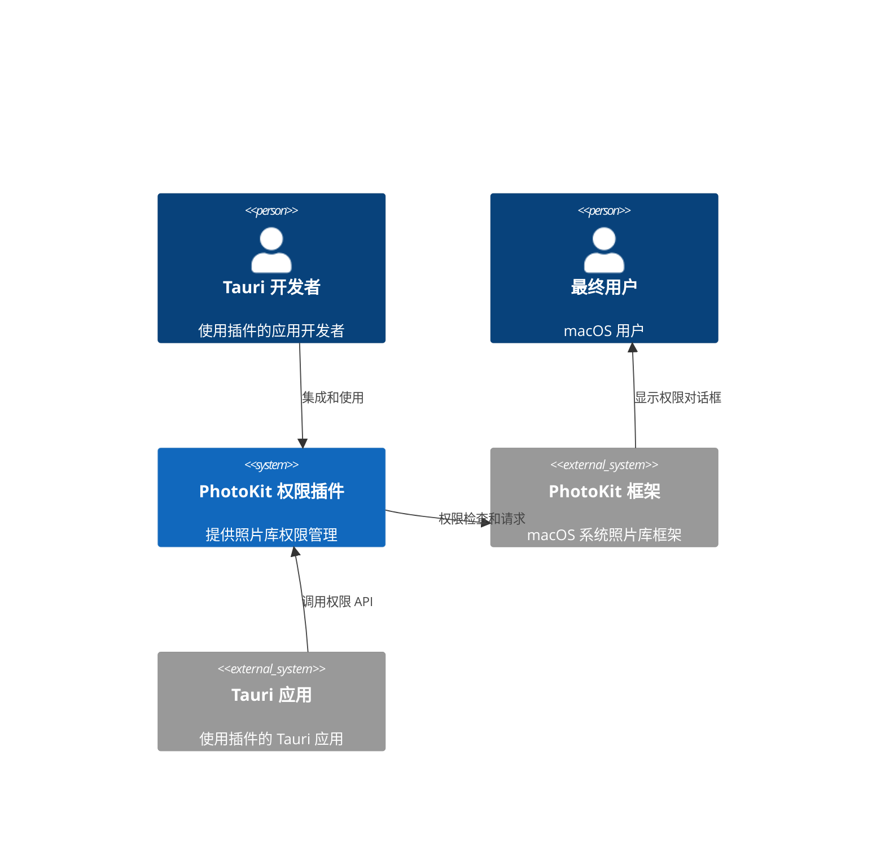
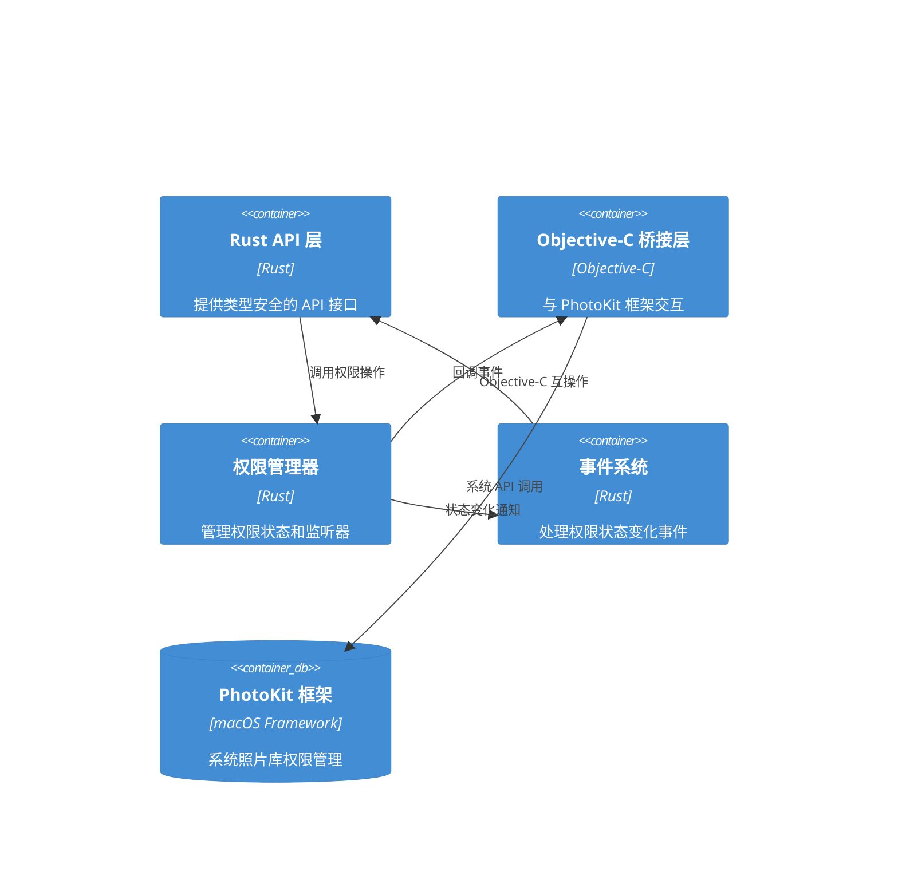

# PhotoKit 权限功能系统架构

## 执行摘要
本文档描述了为 tauri-plugin-macos-permissions 插件添加 PhotoKit 系统相册权限功能的技术架构。该架构基于现有插件的设计模式，通过 Objective-C 互操作实现对 macOS PhotoKit 框架的访问，提供权限检查、请求和状态监听功能。

## 架构概述

### 系统上下文


### 组件架构图


## 技术栈

### 核心技术
| 技术             | 版本    | 用途                | 理由                           |
| ---------------- | ------- | ------------------- | ------------------------------ |
| Rust             | 1.77.2+ | 主要开发语言        | 类型安全、性能、与现有代码一致 |
| objc2            | 0.6+    | Objective-C 互操作  | 已在项目中使用，成熟稳定       |
| objc2-foundation | 0.3+    | Foundation 框架绑定 | 提供基础 Objective-C 类型      |
| tauri            | 2.x     | 插件框架            | 项目要求                       |
| serde            | 1.x     | 序列化支持          | JSON 数据交换                  |

### macOS 框架
| 框架       | 最低版本     | 用途                  |
| ---------- | ------------ | --------------------- |
| PhotoKit   | macOS 10.15+ | 照片库权限管理        |
| Foundation | macOS 10.15+ | 基础 Objective-C 功能 |

## 组件设计

### PhotoKit 权限管理器 (PhotoKitPermissionManager)
**目的**: 核心权限管理组件，协调所有权限相关操作
**技术**: Rust + Objective-C 互操作
**接口**:
- 输入: 权限级别枚举、回调函数
- 输出: 权限状态、操作结果
**依赖**: Objective-C 桥接层、事件系统

### Objective-C 桥接层 (PhotoKitBridge)
**目的**: 封装对 PhotoKit 框架的直接调用
**技术**: Objective-C (通过 objc2)
**接口**:
- 输入: 权限级别、回调指针
- 输出: 权限状态码、操作结果
**依赖**: PhotoKit 框架

### 权限状态监听器 (PermissionStatusListener)
**目的**: 监听和处理权限状态变化
**技术**: Rust + Objective-C 通知
**接口**:
- 输入: 监听器注册/注销请求
- 输出: 状态变化事件
**依赖**: 事件系统、Objective-C 桥接层

### 事件系统 (EventSystem)
**目的**: 管理权限状态变化的事件分发
**技术**: Rust (异步事件处理)
**接口**:
- 输入: 状态变化事件、监听器回调
- 输出: 分发的事件通知
**依赖**: 无

## 数据架构

### 权限级别枚举
```rust
#[derive(Debug, Clone, Copy, PartialEq, Eq, Serialize, Deserialize)]
pub enum PhotoKitAccessLevel {
    /// 只读权限 - 可以读取照片
    Read,
    /// 读写权限 - 可以读取和修改照片
    ReadWrite,
    /// 添加权限 - 只能添加新照片
    AddOnly,
}
```

### 权限状态枚举
```rust
#[derive(Debug, Clone, Copy, PartialEq, Eq, Serialize, Deserialize)]
pub enum PhotoKitAuthorizationStatus {
    /// 未确定 - 用户尚未做出选择
    NotDetermined,
    /// 受限 - 由于家长控制等原因被限制
    Restricted,
    /// 已拒绝 - 用户明确拒绝了权限
    Denied,
    /// 已授权 - 用户已授予权限
    Authorized,
    /// 有限访问 - 用户选择了部分照片访问
    Limited,
}
```

### 权限状态变化事件
```rust
#[derive(Debug, Clone, Serialize, Deserialize)]
pub struct PermissionStatusChangeEvent {
    /// 新的权限状态
    pub new_status: PhotoKitAuthorizationStatus,
    /// 权限级别
    pub access_level: PhotoKitAccessLevel,
    /// 变化时间戳
    pub timestamp: u64,
}
```

## API 设计

### 核心 API 函数
```rust
// 检查权限状态
#[command]
pub async fn check_photokit_permission(
    access_level: PhotoKitAccessLevel
) -> PhotoKitAuthorizationStatus;

// 请求权限
#[command]
pub async fn request_photokit_permission(
    access_level: PhotoKitAccessLevel
) -> Result<PhotoKitAuthorizationStatus, String>;

// 注册状态变化监听器
#[command]
pub async fn register_photokit_permission_listener(
    access_level: PhotoKitAccessLevel
) -> Result<String, String>; // 返回监听器 ID

// 注销状态变化监听器
#[command]
pub async fn unregister_photokit_permission_listener(
    listener_id: String
) -> Result<(), String>;
```

## 安全架构

### 权限验证
- 仅检查权限状态，不访问实际照片内容
- 遵循最小权限原则
- 支持沙盒环境运行

### 数据保护
- 不存储或缓存用户照片数据
- 权限状态信息仅在内存中保存
- 所有敏感操作通过系统 API 执行

### 错误处理
- 所有 Objective-C 调用都有错误检查
- 提供详细的错误信息和恢复建议
- 优雅处理系统权限对话框取消情况

## 性能优化

### 响应时间优化
- 权限检查使用同步 API，响应时间 < 50ms
- 权限请求使用异步 API，避免阻塞主线程
- 状态监听器使用高效的通知机制

### 内存管理
- 使用 Rust 的所有权系统管理内存
- Objective-C 对象使用 ARC 自动管理
- 监听器使用弱引用避免循环引用

### 并发处理
- 支持多个并发权限检查
- 权限请求操作串行化避免冲突
- 状态变化事件异步分发

## 部署架构

### 平台支持
- **主要平台**: macOS 10.15+ (Catalina 及更高版本)
- **兼容平台**: Windows、Linux (提供空实现)
- **架构支持**: x86_64、ARM64 (Apple Silicon)

### 依赖管理
- 使用 Cargo.toml 管理 Rust 依赖
- 通过 build.rs 处理平台特定编译
- 条件编译确保跨平台兼容性

## 监控和可观测性

### 日志记录
- 使用 Rust log crate 进行结构化日志
- 记录权限状态变化和错误信息
- 支持不同日志级别 (debug, info, warn, error)

### 错误追踪
- 详细的错误码和描述
- 堆栈跟踪信息 (debug 模式)
- 操作审计日志

### 性能指标
- 权限检查响应时间
- 内存使用情况
- 事件处理延迟

## 架构决策记录 (ADRs)

### ADR-001: 使用 objc2 进行 Objective-C 互操作
**状态**: 已接受
**上下文**: 需要与 macOS PhotoKit 框架交互
**决策**: 使用 objc2 crate 而不是直接的 C 绑定
**后果**: 提供类型安全的 Objective-C 互操作，与现有代码一致
**替代方案**: 直接 C 绑定、cocoa crate

### ADR-002: 支持所有 PhotoKit 权限级别
**状态**: 已接受
**上下文**: PhotoKit 提供多种权限级别
**决策**: 支持 Read、ReadWrite、AddOnly 三种权限级别
**后果**: 提供完整的权限管理功能，增加 API 复杂性
**替代方案**: 仅支持基本读写权限

### ADR-003: 实现权限状态实时监听
**状态**: 已接受
**上下文**: 用户可能在系统设置中修改权限
**决策**: 实现基于 NSNotification 的状态监听机制
**后果**: 提供实时权限状态更新，增加实现复杂性
**替代方案**: 仅提供主动查询接口

### ADR-004: 不支持 macOS 10.15 以下版本
**状态**: 已接受
**上下文**: PhotoKit 在 macOS 10.15 中引入
**决策**: 要求最低 macOS 10.15，不提供向后兼容
**后果**: 简化实现，但限制了支持的系统版本
**替代方案**: 提供降级实现或警告
