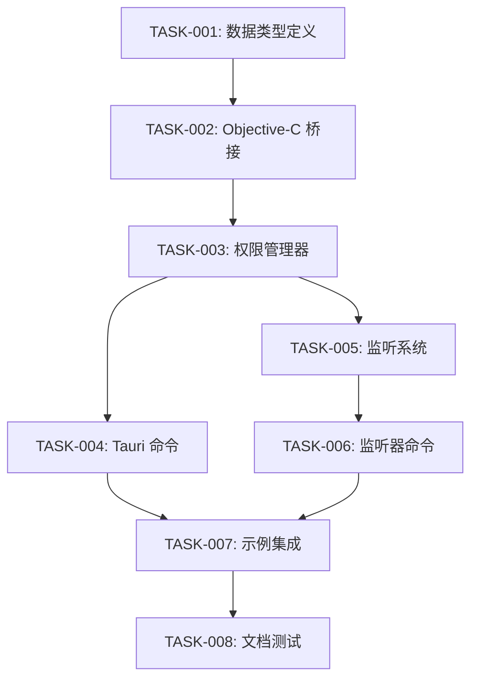

# PhotoKit 权限功能实施任务

## 概述

- **总任务数**: 8个核心任务
- **预估工作量**: 12-15 人天
- **关键路径**: TASK-001 → TASK-002 → TASK-003 → TASK-005
- **并行流**: 2个（基础实现 + 测试开发）
- **实施周期**: 2-3 周

## 任务分解

### 阶段1: 基础架构设置

**持续时间**: 3-4天
**并行度**: 1个开发者

#### TASK-001: 数据类型和枚举定义

**描述**: 定义 PhotoKit 权限相关的 Rust 数据类型和枚举
**优先级**: 高
**复杂度**: 简单 (0.5天)
**依赖**: 无
**验收标准**:

- [x] PhotoKitAccessLevel 枚举已定义
- [x] PhotoKitAuthorizationStatus 枚举已定义
- [x] PermissionStatusChangeEvent 结构体已定义
- [x] 所有类型支持 Serialize/Deserialize
- [x] 类型与 PhotoKit 原生状态一一对应

**实施说明**:

- 在 src/lib.rs 中添加新的数据类型
- 确保与现有代码风格一致
- 添加详细的文档注释
- 实现 Debug, Clone, Copy, PartialEq, Eq traits

**技术要求**:

- 使用 serde 进行序列化支持
- 枚举值与 PhotoKit 常量对应
- 提供类型转换函数

#### TASK-002: Objective-C 桥接层实现

**描述**: 实现与 PhotoKit 框架交互的 Objective-C 桥接代码
**优先级**: 高
**复杂度**: 复杂 (2天)
**依赖**: TASK-001
**验收标准**:

- [ ] PhotoKit 权限状态检查函数
- [ ] PhotoKit 权限请求函数
- [ ] 权限级别参数支持
- [ ] 错误处理和状态转换
- [ ] 内存安全的 Objective-C 互操作

**实施说明**:

- 使用 objc2 crate 进行 Objective-C 互操作
- 实现 PHPhotoLibrary.authorizationStatus() 调用
- 实现 PHPhotoLibrary.requestAuthorization() 调用
- 处理不同权限级别的参数传递

**技术要求**:

- 条件编译支持 (cfg(target_os = "macos"))
- 安全的内存管理
- 错误状态的正确映射
- 异步操作支持

#### TASK-003: 核心权限管理器

**描述**: 实现权限管理的核心 Rust 逻辑
**优先级**: 高
**复杂度**: 中等 (1.5天)
**依赖**: TASK-002
**验收标准**:

- [ ] 权限状态检查逻辑
- [ ] 权限请求协调逻辑
- [ ] 跨平台兼容性处理
- [ ] 错误处理和日志记录
- [ ] 线程安全的状态管理

**实施说明**:

- 创建 PhotoKitPermissionManager 结构体
- 实现状态缓存和更新机制
- 添加适当的错误处理
- 确保线程安全

**技术要求**:

- 使用 Arc<Mutex<T>> 进行状态管理
- 实现适当的错误类型
- 添加日志记录
- 性能优化（缓存机制）

### 阶段2: API 接口实现

**持续时间**: 4-5天
**并行度**: 1个开发者

#### TASK-004: Tauri 命令函数实现

**描述**: 实现暴露给前端的 Tauri 命令函数
**优先级**: 高
**复杂度**: 中等 (1.5天)
**依赖**: TASK-003
**验收标准**:

- [ ] check_photokit_permission 命令
- [ ] request_photokit_permission 命令
- [ ] 参数验证和类型转换
- [ ] 异步操作支持
- [ ] 统一的错误返回格式

**实施说明**:

- 在 src/commands.rs 中添加新命令
- 遵循现有命令的命名和结构模式
- 实现参数验证
- 添加详细的文档注释

**技术要求**:

- 使用 #[command] 宏
- 支持异步操作
- 统一的错误处理
- 与现有 API 风格一致

#### TASK-005: 权限状态监听系统

**描述**: 实现权限状态变化的实时监听和事件分发
**优先级**: 高
**复杂度**: 复杂 (2.5天)
**依赖**: TASK-003
**验收标准**:

- [ ] NSNotificationCenter 监听器注册
- [ ] 权限状态变化检测
- [ ] 事件分发到前端
- [ ] 监听器生命周期管理
- [ ] 多监听器支持

**实施说明**:

- 实现基于 NSNotificationCenter 的监听
- 创建事件分发系统
- 管理监听器的注册和注销
- 处理权限状态变化事件

**技术要求**:

- 使用 Tauri 事件系统
- 实现监听器 ID 管理
- 内存泄漏防护
- 异步事件处理

#### TASK-006: 监听器管理命令

**描述**: 实现监听器注册和注销的 Tauri 命令
**优先级**: 中等
**复杂度**: 简单 (1天)
**依赖**: TASK-005
**验收标准**:

- [ ] register_photokit_permission_listener 命令
- [ ] unregister_photokit_permission_listener 命令
- [ ] 监听器 ID 生成和验证
- [ ] 错误处理和状态检查
- [ ] 资源清理机制

**实施说明**:

- 实现监听器注册命令
- 实现监听器注销命令
- 添加监听器状态验证
- 确保资源正确清理

### 阶段3: 集成和优化

**持续时间**: 3-4天
**并行度**: 1个开发者

#### TASK-007: 示例应用集成

**描述**: 在示例应用中集成和演示 PhotoKit 权限功能
**优先级**: 中等
**复杂度**: 简单 (1天)
**依赖**: TASK-004, TASK-006
**验收标准**:

- [ ] 示例应用中添加 PhotoKit 权限演示
- [ ] 权限检查和请求的 UI 界面
- [ ] 权限状态变化的实时显示
- [ ] 错误处理的用户友好提示
- [ ] 完整的使用流程演示

**实施说明**:

- 在 examples/tauri-app 中添加新页面
- 实现权限管理的 UI 组件
- 添加状态显示和错误处理
- 提供完整的使用示例

#### TASK-008: 文档和测试完善

**描述**: 完善文档、添加测试和进行代码优化
**优先级**: 中等
**复杂度**: 中等 (2天)
**依赖**: TASK-007
**验收标准**:

- [ ] 完整的 API 文档
- [ ] 单元测试覆盖率 ≥ 80%
- [ ] 集成测试用例
- [ ] README 更新
- [ ] 代码质量优化

**实施说明**:

- 添加 rustdoc 文档注释
- 编写单元测试和集成测试
- 更新项目 README
- 进行代码审查和优化

## 风险评估

### 高风险项目

1. **TASK-002: Objective-C 桥接层实现**
   - **风险**: Objective-C 互操作复杂性，内存安全问题
   - **缓解**: 参考现有代码模式，充分测试，代码审查
   - **应急计划**: 简化实现，先支持基本功能

2. **TASK-005: 权限状态监听系统**
   - **风险**: 系统通知机制不稳定，事件丢失
   - **缓解**: 实现重试机制，添加状态同步检查
   - **应急计划**: 降级为轮询检查模式

### 中风险项目

1. **TASK-003: 核心权限管理器**
   - **风险**: 线程安全问题，状态同步复杂性
   - **缓解**: 使用成熟的并发原语，充分测试

2. **TASK-004: Tauri 命令函数实现**
   - **风险**: API 设计不一致，错误处理不完善
   - **缓解**: 遵循现有模式，统一错误处理

### 低风险项目

1. **TASK-001: 数据类型和枚举定义**
2. **TASK-006: 监听器管理命令**
3. **TASK-007: 示例应用集成**
4. **TASK-008: 文档和测试完善**

## 依赖关系图

## 资源分配

### 开发者技能要求

- **Rust 开发者** (1人): Rust、系统编程、Tauri 插件开发
- **macOS 开发经验**: Objective-C、PhotoKit 框架、系统权限
- **前端开发经验**: JavaScript/TypeScript、Tauri 前端集成

### 时间线

- **第1周**: 基础架构 (TASK-001 到 TASK-003)
- **第2周**: API 实现 (TASK-004 到 TASK-006)
- **第3周**: 集成优化 (TASK-007 到 TASK-008)

### 并行工作流

1. **主线开发**: 按依赖顺序实施核心功能
2. **测试开发**: 与主线并行编写测试用例
3. **文档编写**: 与开发同步更新文档

## 质量保证计划

### 代码质量标准

- 所有代码必须通过 rustfmt 格式化
- 使用 clippy 进行代码质量检查
- 单元测试覆盖率 ≥ 80%
- 所有公共 API 必须有文档注释
- 代码审查覆盖所有变更

### 性能标准

- 权限检查响应时间 < 100ms
- 权限请求触发时间 < 200ms
- 内存使用增加 < 1MB
- 事件分发延迟 < 50ms

### 安全要求

- 遵循 Rust 内存安全原则
- Objective-C 互操作安全检查
- 输入参数验证
- 错误信息不泄露敏感数据
- 权限状态缓存安全

## 监控和指标

### 开发指标

- 任务完成速度 (任务/天)
- 代码审查周转时间 (< 24小时)
- 缺陷发现率 (< 5%)
- 测试覆盖率趋势 (持续提升)

### 质量指标

- 代码复杂度 (平均 < 8)
- 技术债务评分 (< 10分)
- 性能基准达成率 (100%)
- 安全扫描通过率 (100%)
